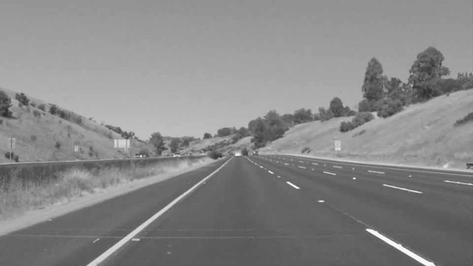
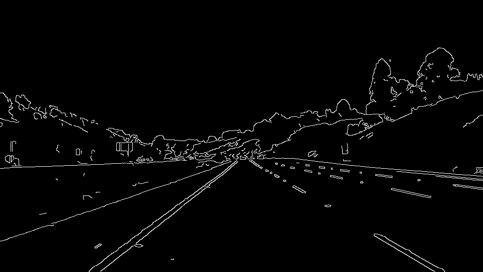
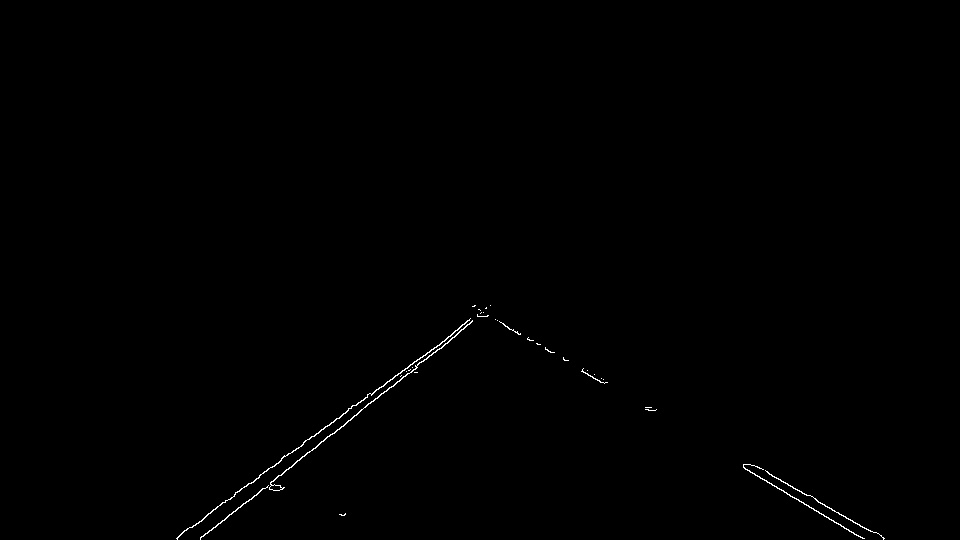
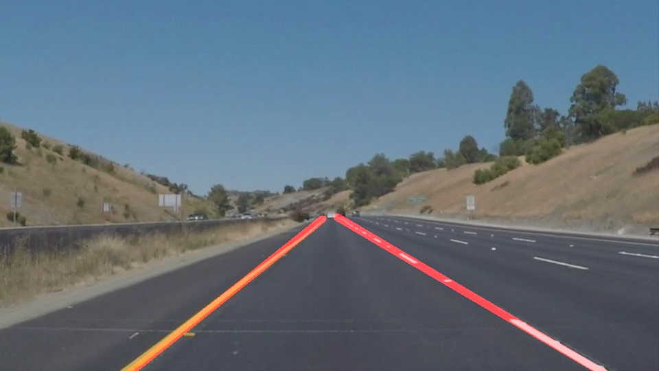

# **Finding Lane Lines on the Road** 

Overview
---

When we drive, we use our eyes to decide where to go.  The lines on the road that show us where the lanes are act as our constant reference for where to steer the vehicle.  Naturally, one of the first things we would like to do in developing a self-driving car is to automatically detect lane lines using an algorithm.

In this project you will detect lane lines in images using Python and OpenCV.  OpenCV means "Open-Source Computer Vision", which is a package that has many useful tools for analyzing images.  

The goals / steps of this project are the following:
•	Make a pipeline that finds lane lines on the road
•	Use the detected line and map out the full extent of the lane lines

Reflection
1.	Pipeline
My pipeline consisted of 5 steps. First, I converted the images to grayscale. 

 
Then, I applied the Gaussian blur to the image to reduce the noise

 
After that, I applied the canny edge detection technique to detect the edges in the picture.
 

Next, I identified the region of the interest which is the lane lines in the picture.

Then, I used Hough transform to detect lines in the image.

Next, I detected lines and map out the full extent of the lane lines. In order to do so, I computed all the slopes and intercepts for both left and right segments and then I found a average value and drew them as a single line. I also, filter the data such as removing the noisy date and replace it by the older data.
 

And finally, I drew lines on the original image.
 

The pipeline is also tested on the video where we apply this pipeline to every single frame of the video. The results are saved in “test_videos_output” folder.

2.	Identify potential shortcomings with your current pipeline

One potential shortcoming would be what would happen when the location of the lines with respect to the frame size are changed.
Another shortcoming could be when the other lines other than the lane lines could be detected in the region of the interest which causes problem in finding the final lines.
The other shortcoming would be when the road is curvy which will make the line detection challenging.

3.	Suggest possible improvements to your pipeline
A possible improvement would be to spend more time in tuning all the parameters. 
Another potential improvement could be using more filter such as “inRange” that only get some specific color from the image. This option is already used in this pipeline that improve the results significantly. However, there is still room to improve the results.

